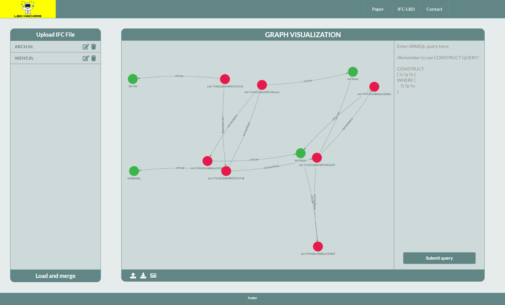

# WEB-LBD-CONVERTER

## Authors:

* <a href="https://www.linkedin.com/in/wojciech-teclaw/" target="_blank">Wojciech Tecław</a>
* <a href="https://www.linkedin.com/in/mads-holten-rasmussen-061b7414/" target="_blank">Mads Holten Rasmussen</a>
* <a href="https://www.linkedin.com/in/jyrki-oraskari-0668b/" target="_blank">Jyrki Oraskari</a>

## Run the application
### Local
### Using NPM in dev mode

Download latest version of Node.js: https://nodejs.org/en/download/

Install all dependencies: `npm install`

Run locally: `npm start`

The application will run on http://localhost:3333

One can change the default port in `webpack.dev.js`

### Using NPM in production mode
Download latest version of Node.js: https://nodejs.org/en/download/
Install all dependencies: `npm install`

Build the application: `npm run build`

Run application using some server:
* Install server `npm i http-server`
* Run server `npm http-server ./`

### Using docker

Run the docker container: `docker-compose up`

The application runs at http://localhost:3000

One can configure the port editing the file or using direct run from Dockerfile:
`docker build -t lbd-vis .`
`docker run -p 1234:80 lbd-vis`

## Usage
### 1. Welcome view

The initial view of the application loads a sample graph.

### 2. Models loading

Clicking `Upload ifc file` button opens new window allowing for import one or more IFC files.

### 3. Uploaded files
After uploading, files are ready to set

### 4. Model parsing settings
After loading user might custom following options:
* BOT => `True/False` Parse to BOT 
* FSO =>`True/False` Parse to FSO
* PRODUCTS =>`True/False` Parse to PRODUCTS
* PROPERTIES =>`True/False` Parse to PROPERTIES

* Normalize SI units => `True/False` Normalize values to SI units according to documentation of [IFC-LBD](https://github.com/LBD-Hackers/IFC-LBD)
* Verbose => `True/False` verbose mode
* Namespace => `string` a custom namespace URI for each model

Clicking on blur closes the window without saving the changes. 

### 5. Model remove
Allows for removing an imported file

### 6. Load the data to the database memory
After appling all settings click `Load and merge` to start using the data. 
Before every reload the database is prune, that is why you can freely change the settings. However, the button triggers following actions
* Parse all models to LBD format
* Connects models spaces and levels using `owl:sameAs` predicate
* Adds all triples to TripleStore

### 7. Querying the database
In the following panel you can query the database. It doesn't allow user to sent two exactly the same query one by one. That is why one has to change anything or add an empty row in the end of the input.

Try sample queries:

* `CONSTRUCT
{?s ?p ?o}
WHERE { 
	?s ?p ?o .
    FILTER(?p = <https://w3id.org/bot#containsElement>)
}
`

* `CONSTRUCT
{?s ?p ?o}
WHERE { 
	?s ?p ?o .
    FILTER(?o = <https://w3id.org/bot#Space>)
}`

<b>Always use !!!CONSTRUCT!!!</b>

### 8. Nodes highlighting
Tapping at a node highlights it and all connected elements. Holding `shift` while clicking turns on modifier allowing for selection of multiple nodes

### 9. Loading new nodes
Double click triggers an action loading from db all neighbour elements of clicked node.

### 10. Hiding unconnected nodes
Right click on a node triggers an action removing nodes and edges being only connected with clicked node

### 11. Download PNG
Clicking at image icon download current view of the graph

### 12. DbDump
Click at download icon triggers an action of downloading all parsed information in form of `ttl` file.

### 13. Upload youdataset

To be continued

