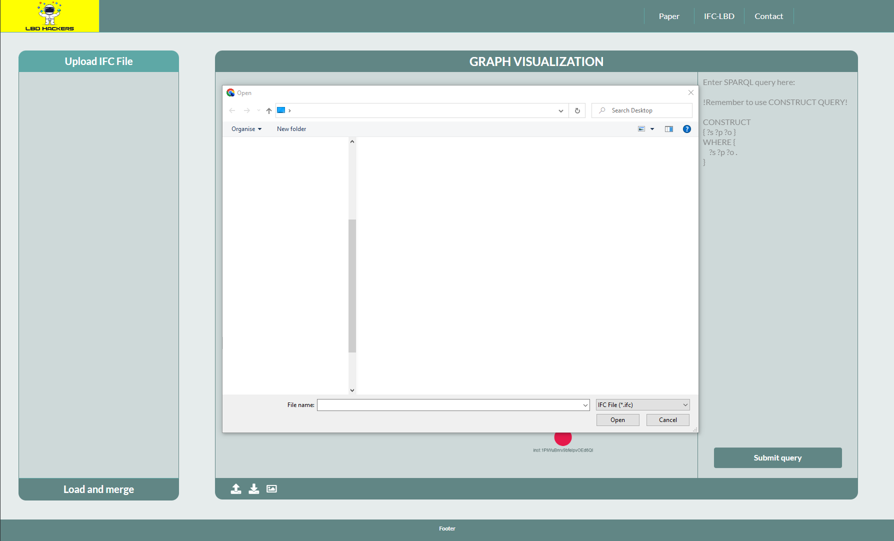
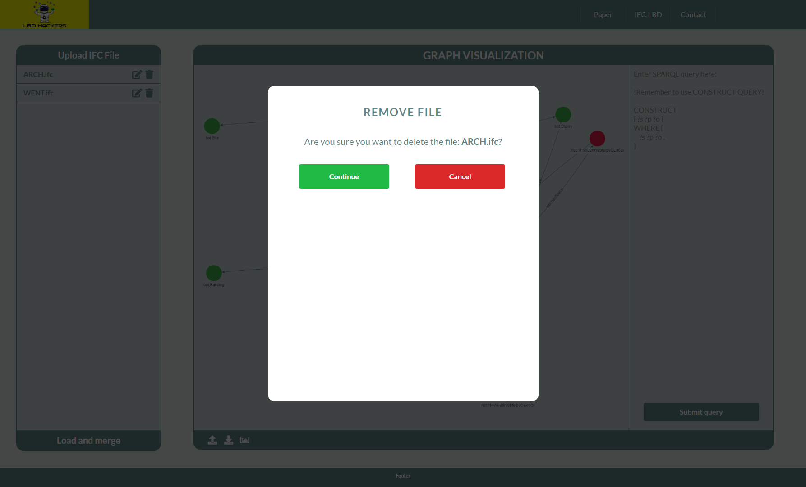

# WEB-LBD-CONVERTER

## Authors:

<a class="link" href="https://www.linkedin.com/in/wojciech-teclaw/" target="_blank">Wojciech Tecław</a> &
<a class="link" href="https://www.linkedin.com/in/mads-holten-rasmussen-061b7414/" target="_blank">Mads Holten Rasmussen</a>

## Local usage

Download latest version of Node.js: https://nodejs.org/en/download/

Install all dependencies: `npm install`

Run locally: `npm start`. The application will run on http://localhost:3333

## Usage
### 1. Welcome view

The initial view of the application loads a same data set for a graph.

### 2. Models loading

Clicking `Upload ifc file` button opens new window allowing for import one or more IFC files.

### 3. Model parsing settings

After loading user might custom following options:
* BOT => `True/False` Parse to BOT 
* FSO =>`True/False` Parse to FSO
* PRODUCTS =>`True/False` Parse to PRODUCTS
* PROPERTIES =>`True/False` Parse to PROPERTIES

* Normalize SI units => `True/False` Normalize values to SI units according to documentation of [IFC-LBD](https://github.com/LBD-Hackers/IFC-LBD)
* Verbose => `True/False` verbose mode
* Namespace => `string` a custom namespace URI for each model

Clicking on blur closes the window without saving the changes. 

### 4. Model remove

Allows for removing an imported file

### 5. Quering the data
After configuration of uploaded models use `Load and merge` button, which triggers following actions
* Parse all models to LBD format
* Connects models spaces and levels using `owl:sameAs` predicate
* Adds all triples to TripleStore

After that models are ready to query using the SPARQL input.

